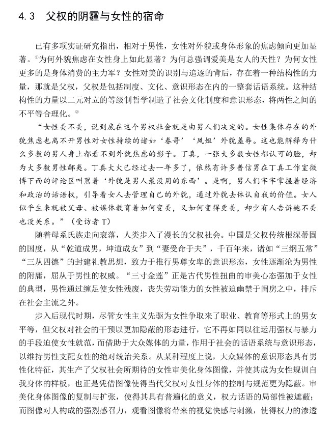
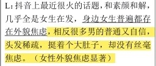
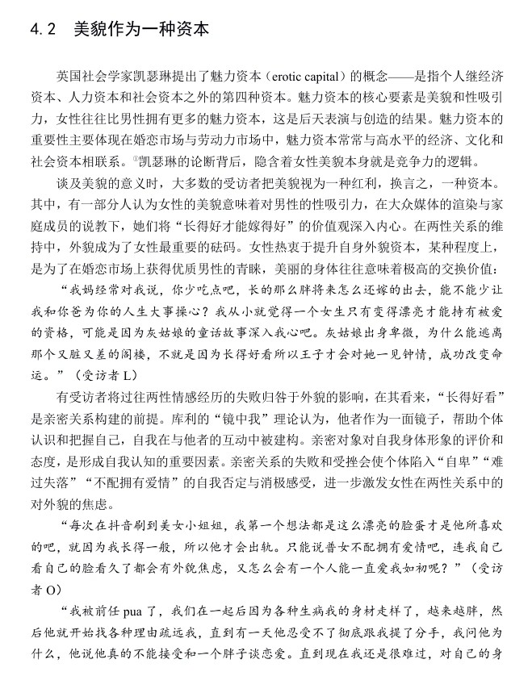

# 短视频时代女性外貌焦虑论文的偏颇特征分析

基于对“短视频时代女性外貌焦虑的社会文化成因分析 ——基于抖音APP用户的实证研究”论文的梳理，从**数据谬误**、**写作风格失当**、**论证逻辑缺陷**三方面，剖析其与规范学术论文的差异，辅助材料为论文及数据错误、表述争议相关截图（对应文件夹 `evidence` 中图片 ）。  

## 一、数据采集：基础信息失真，学术严谨性缺失

规范学术论文需严格校验样本数据的真实性与合理性，但该论文存在**低级数据谬误**：  

- **年龄与时长逻辑矛盾**：样本中出现“735岁用户”  

    

  违背人类寿命常识；
  - ~~同时存在“抖音使用时长6年”表述（实际抖音发展年限与该时长冲突）~~（样本中 “使用时长 6 年” 的表述具有一定合理性，可不追究），说明数据采集未做基本真实性核查，研究前提（样本有效性）不成立，与规范论文“数据精准、逻辑自洽”要求背道而驰。

- **方法论细节的缺失**：原论文样本选取基于 “社交外貌焦虑量表（SAAS）得分高于平均水平”（），但未明确说明量表的信效度检验过程（如是否适配抖音用户群体），这一方法论细节的缺失也影响数据说服力，但用户未提及。

## 二、写作风格：理论术语与立场倾向的边界争议

学术写作强调**中性、克制、分析性语言**，但该论文存在强烈“立场先行”倾向（对应

  

等内容）：  
以及“~~普通而自信~~” **（此语言来自于受访者引用，论文仅为客观呈现受访者观点，并非论文自身的价值判断）** 这类关联极端女权争议词汇“普信男”的表述（对应下图）

 

- **情绪化表述泛滥**： 如 ~~“父权给予顺从女性奖励以收编她们”“女性是父权话语的代理人”等语句（见上图片段），更像网络女性主义长文风格，缺乏学术论证的理性推导，属于“立场先行型写作”，不符合学术训练对“客观分析”的要求。~~ 论文中 “父权的阴霾”“男性凝视” 等表述，源于女性主义与媒介批判理论的核心概念（如劳拉・穆尔维的 “男性凝视” 理论），是学术研究中对性别权力结构的常规分析术语，并非 “情绪化表述”。此前将其等同于 “网络女性主义长文风格”，存在对学术理论术语的误解。

### 但是仍然需要注意

论文在分析父权文化影响时，出现 “女性是父权话语的代理人” 等表述，此类表述隐含对女性行为的价值判断，未通过实证数据充分支撑，带有一定的立场先行倾向，偏离了学术论文 **“价值中立”** 的要求。

## 三、论证逻辑：案例与概念脱节，缺乏实证支撑

规范论文需通过**严谨论证框架**（理论+实证+分析 ）推导结论，但该论文存在明显逻辑缺陷：  

- **案例运用随意**：以丁真案例讨论男性审美时
    
  
  未清晰论证“男性传统形象”与“女性外貌焦虑”的关联逻辑，案例仅停留在现象描述，未嵌入学术分析框架；部分概念（如“魅力资本”，对应  
    
  ）引用后，未结合数据或理论深入阐释，陷入“观点堆砌”误区，无法形成有效学术论证。  

综上，该论文因**数据失真、风格失当、逻辑缺陷**，与规范学术论文的“严谨性、客观性、逻辑性”要求差距显著，暴露学术写作中态度与方法的双重不足，需在数据校验、语言规范、论证体系构建上全面修正。

### 对《短视频时代女性外貌焦虑论文的偏颇特征分析》的修正与补充  

结合《短视频时代女性外貌焦虑的社会文化成因分析_詹景茜.pdf》内容，从数据采集、写作风格、论证逻辑三方面，客观剖析论文与规范学术论文的差异，修正此前分析中的误解与偏颇，补充遗漏细节如下：  

## 四、框架：框架合理但部分环节松散

规范学术论文需构建“理论-实证-分析”的严谨链条，该论文整体框架符合质性研究规范，但部分论证存在缺陷：  

### 1. 合理的论证框架：扎根理论的方法应用  

论文采用深度访谈法，通过开放式编码（49个概念、17个范畴）、主轴编码（7个主范畴）、选择性编码（3个核心范畴）的扎根理论流程，最终提炼出“视觉文化、消费文化、父权文化”三因素分析框架，方法论符合质性研究的基本规范。

### 2. 明确的逻辑缺陷：案例与核心论点关联薄弱

在讨论“女性凝视”时，论文引入**丁真**案例以对比男性与女性凝视的差异，但未清晰阐释该案例与“女性外貌焦虑成因”的直接关联，案例仅停留在现象描述，未嵌入“短视频时代女性焦虑”的核心分析框架，论证链条存在断裂。  

## 总结  

该论文在数据校验、表述中立性、论证细节等方面存在明显缺陷，与规范学术论文的要求存在差距，主要体现为：低级数据录入错误、部分表述的立场预设、个别案例论证松散。
